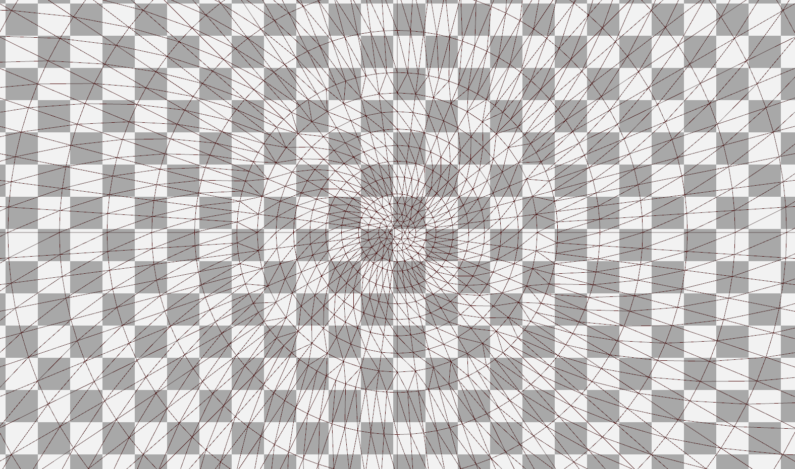

# Winamp AVS Direct3D Port

## Current Status

About half of Winamp’s built-in AVS presets work on my PC, delivering silky smooth 60 Hz @ 3840×2160. By comparison, old CPU-based AVS from 2005 renders most presets at 8-15 FPS at that resolution.

Other half don’t, results vary from black or white screen, to shaders failing to compile.

Here’s the list of built-in effects **not** implemented in the current version.

* Render / Bass Spin: Simple geometry, either 4 triangles, or 2 short polylines. Complex motion formula, however.
* Render / Dot Grid: User can set it to render 2x2 grid, particles won't work, too many of them. A fullscreen pixel shader will do, however for sparse grids particles will do better, less overdraw.
* Render / Dot Plane: Particle effect modulated with wave data.
* Trans / Grain: Just a pixel noise.
* Trans / Multi Delay: Not actually sure what it does.
* Render / Ring: Simple polyline, cycling color.
* Render / Oscilliscope Star: A few polylines, cycling color.
* Trans / Roto Blitter: Simple VS, just 4 vertices to calculate, but quite complex logic.
* Render / Rotating Stars: A few polylines, cycling color.
* Trans / Scatter: Noise in UV channel, quite expensive to compute, need to do per pixel. Probably need a CPU-generated noise texture.
* Render / Text: Straightforward to implement but will take a lot of code, need to replace GDI with DirectWrite.
* Render / Timescope: Very simple shader and very fast implementation, just a single 1 pixel width quad, or a vertical line.
* Trans / Video Delay: Not actually sure what it does.
* Trans / Water Bump: Refraction-like offset map. Probably need to limit simultaneous drops count to a small number like 8-16, and process all of them in a single PS pass.

Following built-in APEs are **not** supported:

* fyrewurx.ape
* multifilter.ape
* texer2.ape

All these effects don't affect the output, new renderer just skips them. Will do if/when I’ll have time for that.

The rest of them work, with varying levels of compatibility.

The product requires Windows 8.0 or newer, only tested on 8.1 and 10 with Winamp 5.8. Only tested with NVidia 1080Ti, Intel Iris 550, and VMWare SVGA 3D.


## Intro

I’ve started this project in the end of 2018. Luckily, this means I can rely on users having Direct3D 11 capable hardware: the last D3D 10.1 GPU was Intel Sandy Bridge from 2011, I think it’s OK to drop the support already.

Using D3D 11.0 means I can use compute and geometry shaders, both are extremely helpful for this project.

Winamp visualizations are unusual use case for D3D, for several reasons.

1. Users can write code. The original CPU code used JIT compiler to produce x87 code from these expressions. I thought about staying on CPU and updating the code generator to emit SSE/AVX instead of x87, however modern GPUs are just too powerful to ignore. Even for relatively slow Intel GPUs, the difference is 1-2 orders of magnitude. GPUs are also much more power efficient.

2. Very few assets.

3. Users rarely mess with the controls, i.e. typically there’s very few changes between frames.

## Project Scope

Ideally, I want 100% compatible re-implementation. Realistically, it’s quite hard to achieve: too many effects, and also the computation model is too different. In AVS you can easily implement dependencies across pixels. GPUs can’t easily do that while staying within reasonable performance.

## Architecture

Because users can code, my app needs to compile that code into shaders. And since I need to do that anyway, this means I can use same mechanism to offload as much work as possible to the shader’s compile-time. This has downside of changes taking slightly longer to apply (some changes even cause all shaders to be recompiled), but this is fast enough, and the runtime performance is better.

Eventually I have implemented effects with very complex code, like convolution.ape, where the HLSL contains unrolled 7x7 loop to compute that convolution. Shader compilation time started to affect user experience. Fortunately, the HLSL compiler in d3dcompiler_47.dll is thread safe, I have offloaded compilation to the Windows built-in thread pool and it became good again.

AVS editor has a lot of rich GUI coded in WinAPI. Being too lazy to port everything to a modern GUI framework, I left most GUI intact. Well, not completely, I changed a few things (the most visible one is fonts, the original ones didn’t support high DPI), but for 90% of the GUI the old one is IMO good enough.

## Known Issues

### General

New effects render sprites or thick lines instead of just pixels. Currently, there’s no way to modify the default thickness value. For line widths, “Misc / Set render mode” effect works as expected.


### Expressions

assign(if(v,a,b),1.0) trick is not currently supported.

### Superscope

Currently, the expressions can’t change line/dot modes, they can’t skip points, and they can’t adjust line thickness.

## Q&A Users

### Is the result pixel perfect?

No. I could implement everything in compute shaders to make it so, but it made no sense: modern displays have too high resolutions. That’s why D3D effects render point sprites & thick lines instead of pixels.

### How to debug the presets?

[Renderdoc](https://renderdoc.org/) helps a lot.

## Q&A Developers

### Why are you releasing this?

To be able to easily reuse the code in proprietary software I’m working on. “Easily” = without legal departments involved.

Also, in my experience having high quality open source projects that I find interesting helps finding work that I find interesting.

### How to build?

Install Visual Studio 2017, I’m using the freeware community edition, version 15.9.5 at the time of writing. Open the solution and press build. Because Winamp is a 32-bit app, only 32-bit build target is supported.


### Why are you compressing these shaders? And why the proprietary compression instead of gzip?

It was simple thing to do. T4 engine I use for shaders metaprogramming is running full-blown .NET so native interop is quite simple.
Look at avs_dx\DxVisuals\compress.t4 source file, it’s less than a page of code. Decompressor is in DxVisuals\Utils\decompressor.cpp, very simple as well.
As to why this specific compressor — because AFAIK there’s no built-in gzip available to native code in Windows (there is one in .NET but AVS doesn’t use .NET in runtime), and I didn’t want to introduce another dependency.

### Why are you always rendering full-screen triangles, D3D 11 supports read/write textures in compute shaders?

Effects use fixed function blending functionality of the output merger stage, not available to compute shaders. It’s slightly faster than computing blending manually in shader code.

## Interesting Pieces

Most of the code is straightforward, bind / draw / unbind / copy / etc, traditional 3D graphics stuff. But some parts do more interesting things.

### HLSL Preprocessor

There’s a gap between Direct3D and game engines. D3D is too low level. Game engines are huge, they’re cross-platform which implies certain set of tradeoffs, and they are too high-level. I wanted something in between.

Once upon a time there were effect files, `.fx`, but apparently the support is [deprecated](https://stackoverflow.com/a/3536401/126995).

In this project I’ve implemented compile-time preprocessing for shaders, in C# language inside text template files. The templates detect constants, macros and resource bindings, and generate C++ classes from these shaders. The same templates also strip comments, and compress shaders HLSL code into large binary blobs that are embedded into C++ source.

### Expression Compiler

Effects like dynamic move, superscope, and couple of others allow users to write expression code in AVS editor. Apparently, the expression language is called NSEEL, I guess the acronym is for NullSoft Effects Expression Language.

Original AVS implemented a JIT compiler, these expressions were compiled into legacy x87 instructions. Modern compilers emit SSE code instead, and in some runtime environments like Windows kernel x87 instructions are just forbidden.

I wanted expressions to run on GPU so I had to do something else instead. Besides, I didn’t like their stack much, they use GNU Bison from 1985, almost as old as I am.

Microsoft no longer supports authoring shaders in assembly. It’s technically possible, I did in one project to inject my code in the shaders I didn’t have source code for. But it’s unsupported, and relatively hard to accomplish, especially producing the correct signature chunks. That’s why I decided to compile the expressions to HLSL.
The code in avs_dx\DxVisuals\Expressions does just that.

The parser does not produce the complete expression tree. It only parses 2 things: variables, and function calls. The rest of the code is left in strings.
That’s simpler and therefore faster than parsing into full-blown expression trees, but still enough to deduce variable types reasonably well. 
In original code there were no types, everything was 80-bit floats.
GPUs only have 64-bit floats, they’re limited, and relatively slow to operate, I wanted to use faster 32-bit types as much as possible.

### Move Effects

Both dynamic and static move effects work in similar fashion, the screen is split into 32x32 rectangles, the expression is evaluated for each node, then the rectangles are transformed according to the expression output.
For better visual quality I’m building more sophisticated triangle mesh for these effects, user-written code runs in vertex shader and produces UV texture coordinates. D3D does the rest.

To improve the result near the center for move effects in polar coordinates, I have initially implemented tessellation of the central area, but later replaced it with purposely-built radially symmetric mesh.

Direct3D:



Original:



Direct3D radial mesh, as seen in renderdoc:



Center of that mesh:



### Videos & Pictures

The old AVS only supported AVI and BMP. The new one supports any format Windows have codecs for.
I use hardware-accelerated [Media Foundation](https://docs.microsoft.com/en-us/windows/desktop/medfound/microsoft-media-foundation-sdk) for videos,
and [Windows Imaging Component](https://docs.microsoft.com/en-us/windows/desktop/wic/-wic-about-windows-imaging-codec) for pictures.

In addition, I now follow shortcuts. You can make *.lnk shortcuts in Winamp\Plugins\avs instead of copying the files there.

### Blur

I’ve found a method to implement Gaussian blur of arbitrary size spending slightly more than 1 texture read per pixel per pass (two passes are required).
See LinearConvolutionCS.hlsl for the source, and LinearConvolution.txt for some ASCII “art” that explains how it works.
Both files are in avs_dx\DxVisuals\Effects\Trans\Blur folder.

The trick is optimizing the algorithm for RAM access patterns. BTW that’s typical in modern world with very fast processors, be it CPU or GPU, and, in comparison, very slow memory.

On a desktop PC with 1080 Ti it takes 0.9ms to apply 19x19 Gaussian blur to 1920x1080 frame.
On a netbook with Iris 550 the result is more modest, 8-9ms for FullHD frame.
The result is roughly proportional to the raw performance, which is 10.6 TFlops for Nvidia versus just 0.84 TFlops for Intel.

### APEs

AVS ships with several DLL-based plugins called APE. Many built-in presets use them a lot, especially color map and convolution.
They present a few challenges. Their source code is not available. And they were built with VC6 and linked against that ancient C runtime dll.











